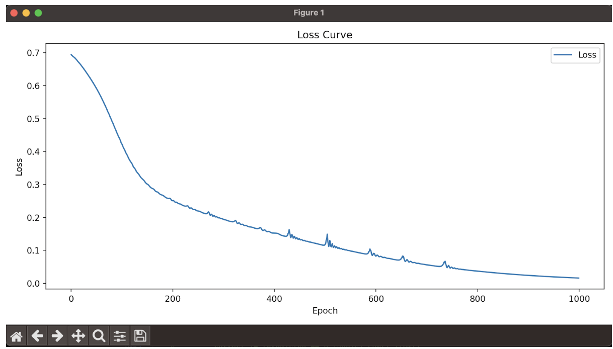
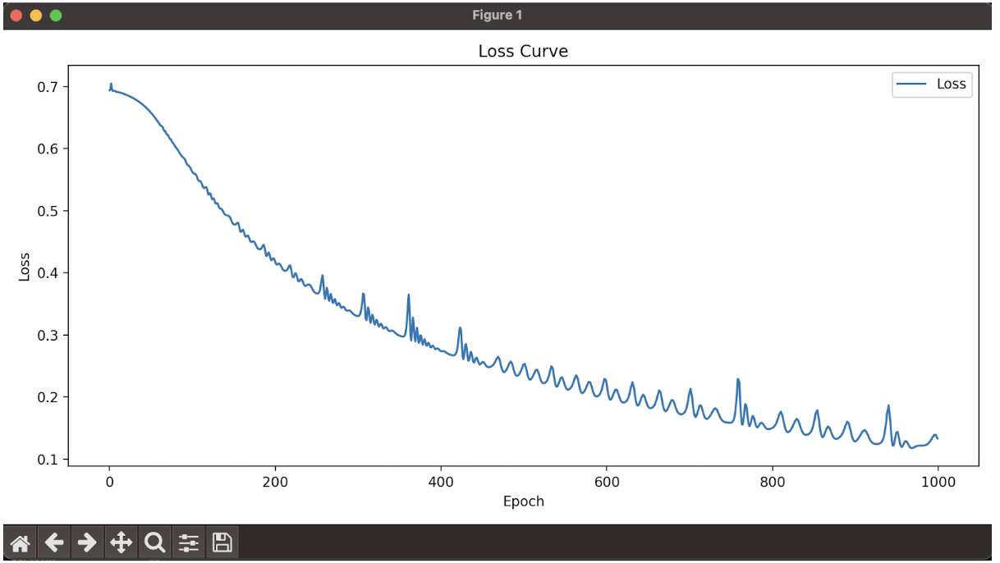
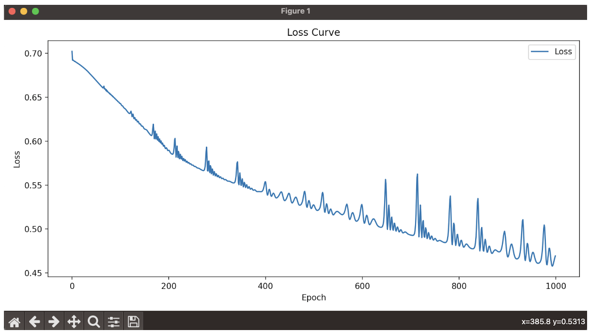
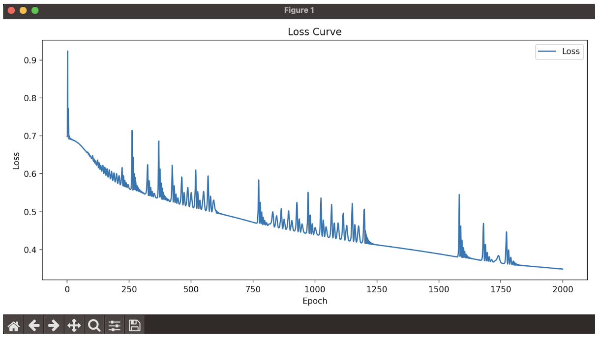
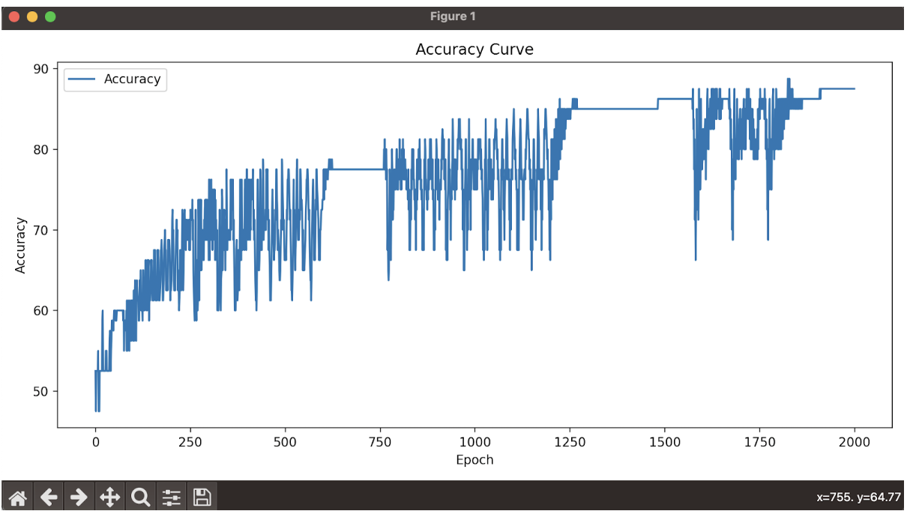
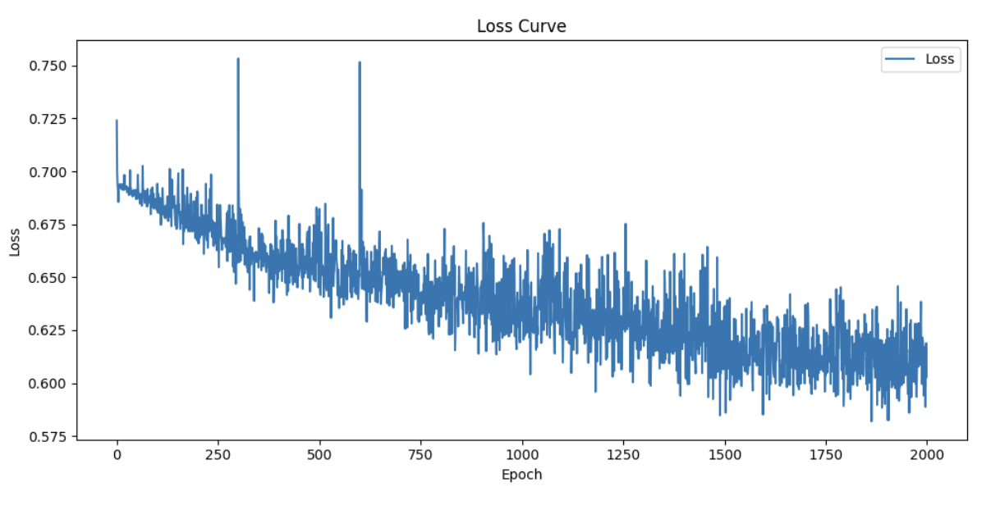
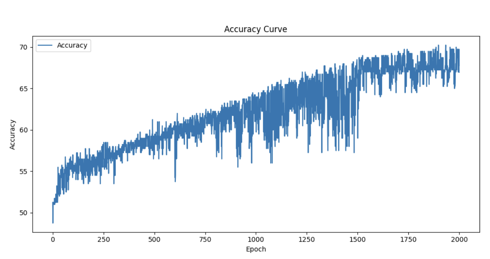
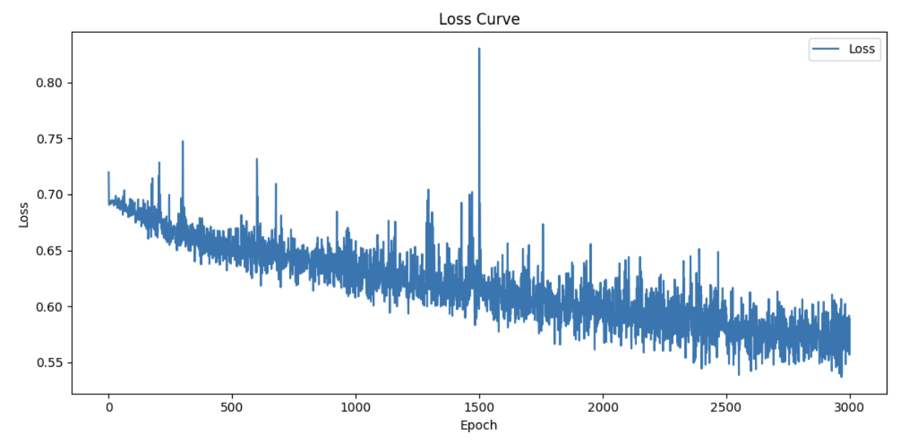

<!-- Title -->
<h1 align="center">Spam Email Detection</h1>

Erwan LEBAILLY et Benjamin ZHU - 4A Mines Nancy - 18 Décembre 2023

<!-- Introduction -->
<h2>Introduction</h2>

En 2023, le spam représente environ entre 70% et 80% du trafic total de l’email. La majeure partie est filtrée en amont par les outils anti-spams des messagerie et le reste tombe dans le dossier Indésirables. Ces spams représentent également une source de danger pour certaines personnes (phishing). C’est donc sur cette thématique, actuelle, que nous avons choisi de travailler et d’entraîner un modèle de Machine Learning pouvant détecter la nature du mail.

Le code se trouve sur le répertoire Github suivant : https://github.com/LittleDragoon/MachineLearning

 
<!-- Choix dataset -->
<h2>Choix du Dataset</h2>

Pour ce faire, nous avons trouvé deux jeux de données en open-source intéressants que sont “Spambase dataset” et “Enron Dataset”.
  
Au tout début du projet, nous avons choisi Spambase qui est un dataset contenant 4601 mails, avec une proportion de 39,4% de spams et 60,6% de ham (non-spam). Chaque mail, associé à un label 1 pour spam et 0 pour ham, est déjà transformé sous forme d’un vecteur de 57 features spécifique aux mails, comme la fréquence des mots. Cependant, cette transformation induit nécessairement une limitation. En effet, le choix des features est déjà une réduction de l’information et constitue un biais. 
  
Afin d’éviter cela, nous avons ensuite décidé d’exploiter le dataset Enron, contenant environ 500 000 emails en anglais, générés par les 150 employés de Enron Corporation dans les années 2000. Pour notre cas, n’ayant pas de carte graphique suffisamment puissante ou très peu de ressources pour faire tourner un modèle sur un large dataset, nous avons décidé de réaliser l’entraînement sur seulement quelques centaines ou milliers d'emails avec une répartition parfaite entre le nombre de spams et de hams. Le modèle associé à ce dataset sera un modèle BERT, performant pour transformer les mails en tokens et de créer des embeddings.

 
<!-- Charger dataset -->
<h2>Charger le dataset</h2>

Pour récupérer les données, nous avons utilisé comme point de départ un répertoire [Github](https://github.com/sijoonlee/spam-ham-walkthrough?tab=readme-ov-file) et plus particulièrement son fichier file_reader.py.

 Ce programme nous permet de choisir un nombre de mails, de les charger à partir des dossiers “enron” en local, puis de concaténer les spams et les hams dans une variable data. En sortie, nous obtenons cette variable <i>data</i>, et un tensor de label associé aux mails (<i>y_label</i>). 
 
 
N’ayant pas trouvé de projet similaire, pour toute la suite du projet, nous avons nous-mêmes écrit le code.

 
<!-- Process dataset -->
<h2>Pre-process le dataset</h2>

Une fois les données récupérées, les données sont pré-processées dans le fichier <i>preprocess_text.py</i>. Cette étape constitue un aspect important qui permet d’enlever toutes les informations “inutiles” dans les données, comme les majuscules, la ponctuation ou même les sauts de lignes. Nous avons également introduit une étape de “stemming” pour transformer chaque mot en son mot “racine”. 

 
<!-- Tokenization -->
<h2>Tokenization du dataset via Bert</h2>

Vous trouverez le code dans le fichier <i>“./embeddings.py”</i>.
  

Nous utilisons ici le tokenizer du modèle “bert-base-uncased” qui est une solution classique et efficace pour tokenizer du texte, c’est-à-dire transformer du texte en données recevables par le modèle.

Il existe néanmoins une contrainte : l’input ne doit pas dépasser une taille maximale de 512 tokens. C’est pourquoi pour chaque mail, nous le décomposons en “batch”, le tokenisons, et le concaténons par la suite avec le reste des batchs.
Par la suite, comme chaque mail tokenisé doit faire la même longueur (_max_len_), nous appliquons un “padding” aux mails trop courts (rajouter les 0 jusqu’à ce que les tokens fassent la bonne taille) et nous troquons les mails trop longs.
Ce ne sera un problème pour la suite car le tensor _attention_mask_, composé de 1 ou de 0, donne les informations nécessaires au modèle pour identifier le padding.

 
<!-- Embeddings -->
<h2>Embeddings du dataset via Bert</h2>

Dans un premier temps, nous avons tenté de fine-tuner le BERT, mais cela n’a pas été réalisable avec le matériel dont nous disposions. Nous avons également tenté de réaliser le finetuning sur le modèle Albert, qui dispose de 11 millions de paramètres, soit dix fois moins que Bert. Cependant, cela nécessitait aussi des ressources trop importantes. Nous avons donc fait le choix de ne pas fine-tuner le Bert pré-entraîné et de ne générer qu’une seule fois les embeddings. 
  

Nous avons réparti les données en 80% pour le jeu de données train et 20% pour le test. Pour chaque jeu de donnée, nous transformons les tokens en embeddings avec la fonction _extract_bert_embeddings_. Cette fonction prend en entrée le modèle Bert, le jeu de donnée et le tenseur d’attention_mask, et calcule les embeddings. De ces données, nous extrayons le token de classification ([CLS]), qui doit permettre de capter le sens des données en entrée.

Par manque de ressources (puissance / RAM), nous avons fait le choix d’enregistrer les embeddings dans des fichiers .pt, avec _torch.save()_, pour pouvoir les entraîner dans le MLP plus facilement.

 
<!-- Dataloaders -->
<h2>Création des datasets et dataloaders</h2>

Vous trouverez le code dans le fichier <i>“./run_MLP.py”</i>.
  

Nous avons créé une fonction _load_files_ qui récupère tous les fichiers train et test, dans le dossier _embeddings_. Ces fichiers seront ensuite mis dans des datasets et des dataloaders.

 
<!-- MLP -->
<h2>Création d’un MLP</h2>

Pour réaliser cette classification binaire entre les spams et les non-spams, nous avons codé un réseau de neurones Multi-Perceptron (MLP) classique, qui comporte une ou plusieurs couches cachées linéaires suivies de fonctions d’activations ReLU. 
  

La fonction de perte utilisée est la _CrossEntropyLoss_ adaptée pour la classification binaire et l’optimiseur est l’optimiseur _Adam_ avec un processus de rétropropagation / descente de gradient comme vu en cours.

Les hyperparamètres sont :

|        Hyperparamètres        |              Variable associée              | Localisation dans le code  |
| :---------------------------: | :-----------------------------------------: | :------------------------: |
|       Taille du dataset       |              2 \* number_spam               | embeddings.py |
|  Taille des tokens des mails  |                   max_len                   | embeddings.py |
|       Taille des batchs       |                 Batch_size                  |         run_MLP.py         |
|   Nombre de couches du MLP    |                Entre 1 et 3                 |         run_MLP.py         |
| Nombre de neurones par couche | Hidden_size_1, Hidden_size_2, Hidden_size_3 |         run_MLP.py         |
|         Learning rate         |                     lr                      |         run_MLP.py         |

 
<!-- Résultats -->
<h2>Résultats (Training et Accuracy)</h2>

Nous avons tenté dans un premier temps d’entraîner le modèle en se limitant pour chaque mail à la taille maximum que peut accepter le Bert, à savoir 512 tokens. Cependant, cela induisait une trop grande réduction de la taille des mails et nous ne parvenions pas à faire diminuer la training loss.
  

Le mail le plus long conduisant à environ 40.000 tokens, nous avons décidé d’augmenter le nombre de tokens à 20.480. Cela permettait de ne pas trop couper les mails et de tout de même disposer de suffisamment d'informations pour chaque mail. Cela nous a donc semblé être un bon compromis quantité d’information/performance.

Dans un premier temps, nous avons réalisé un entraînement avec entre 2.000 et 6.000 mails. Il s’est avéré que la loss ne diminuait pas significativement et l’accuracy du modèle sur la base de test n’augmentait pas non plus. En réponse à cela, nous avons tenté d’augmenter le nombre de couches du MLP (de 1 à 3), d’augmenter le nombre de neurones par couches (jusqu’à 2.000) et même essayé de nombreuses valeurs pour le learning rate et la taille des batchs. En vain.

Pour simplifier le problème et comprendre la racine du problème, nous avons donc décidé de réduire drastiquement le nombre de mails puis de l’augmenter au fur et à mesure. L’idée était de trouver des paramètres qui permettent de faire diminuer la training loss, puis d’utiliser ces paramètres comme point de départ pour réaliser l’apprentissage avec un nombre de données plus important.

1. Loss obtenu avec 16 mails de training

   

En utilisant un MLP à 3 couches, de 500, 100 puis 20 neurones; un learning rate de 0.0001, nous somme parvenu à faire tomber la training loss à 0. Ce modèle est probablement trop grand pour s’entraîner avec seulement 16 mails, mais notre objectif premier était de faire diminuer la loss, et ce modèle y parvient.

Nous sommes également parvenus à faire diminuer la loss avec un MLP à une seule couche de 100 neurones avec un training de plusieurs milliers d’épochs.

2. Nous avons ensuite augmenté le nombre de mails de training à 32.

3. 1. Puis avec 80 mails

On remarque que la training loss descend beaucoup moins.

3. 2. Pour contrer cela, nous avons mis en place un learning rate évolutif, qui commence à lr = 0.0005 puis diminue de moitié toutes les 600 épochs. Cela a permis d’obtenir de meilleurs résultats.

Nous calculions en même temps l’accuracy sur la base de train pour suivre la capacité d’apprentissage du modèle. Jusque là, nous observions une accuracy proche de 90%.

4. 1. Nous avons ensuite augmenté le nombre de mails à 500 (400 pour le training, 100 pour le test)

Nous ne sommes pas parvenus cette fois-ci à faire diminuer énormément la training loss. On remarque également que l’accuracy sur la base de train ne dépasse pas les 70%. Nous avons tenté d’augmenter la capacité de notre modèle en augmentant le nombre de neurones par couches, en modifiant le nombre de mails par batch et en augmentant le nombre d’épochs.

4. 2. Voici le résultat auquel nous sommes parvenus avec un MLP disposant de 800 neurones sur sa première couche, 200 sur la seconde et 20 sur la dernière, un learning rate qui débute à lr à 0.00007 puis diminue progressivement jusqu’à 0.00003 et des batchs de 200 mails :

On remarque que la training loss diminue davantage, même si cela paraît peu. Néanmoins, nous pouvons constater un début d’apprentissage avec le modèle obtenu, puisque celui-ci obtient une accuracy d’environ 60% sur une base de test comportant 100 mails.

 
<!-- Conclusion -->
<h2>Conclusion</h2>

Au début de notre projet, nous ne parvenions pas à faire apprendre notre modèle sur une base de plusieurs milliers d’emails : la training loss diminuait peu voire pas du tout et l’accuracy sur la base de test stagnait aux alentours de 50%. Nous pouvions alors douter de la capacité même du MLP à classifier les mails à partir des tokens de classification que lui transmettait le Bert. En effet, nous avions conscience que l’idéal aurait été de fine-tuner le Bert, mais nous n’en avions pas les capacités.
  
En recommençant le processus d’apprentissage avec un nombre réduit de mail, nous sommes parvenus à faire diminuer plus facilement la training loss en ajustant les paramètres du modèle. En augmentant le nombre d’emails, la diminution de la training loss était moins marquée, mais toujours présente. Pour des raisons de temps, nous nous sommes arrêtés à un apprentissage sur une base de 500 mails. 
Avec le modèle obtenu, nous avons pu constater une accuracy sur la base de test allant jusqu’à 63%. Ce résultat est significativement meilleur que ce que nous avions au tout début et constitue en soi la preuve que notre modèle est capable d’apprendre à classifier les mails.

 
 
Nous avons conscience que ce résultat est loin de ce qu’il serait possible d’obtenir en réalisant le fine-tuning d’un modèle Bert, ou même en conservant notre modèle. En effet, nous sommes convaincus qu’avec davantage de temps et/ou de ressources, il serait possible de trouver d’encore meilleurs paramètres et de parvenir à faire apprendre la classification des spams au modèle en lui fournissant bien plus que 500 mails.

Une autre solution que nous n’avons pas expérimentée serait de figer certains paramètres du Bert ou de Albert en utilisant des méthodes comme LoRa ou QLoRa et qui permettraient de réaliser l’apprentissage plus facilement.

 
<!-- Rétrospective -->
<h2>Rétrospective sur le projet</h2>

Cette partie, absolument facultative pour le rapport, est personnelle et permet de laisser une trace de notre pensée tout au long de ce projet.

 
 

**_Problèmes rencontrés_** :

- Un projet ambitieux sur le traitement du langage pour des néophytes, en partant d’une “page blanche”, qui nécessite des modèles avec beaucoup de paramètres et impose de trouver des solutions.
- Des ressources limitées (RAM / CPU) qui ont ralenti et bloqué le projet à certaines étapes, surtout lors de l'analyse des résultats (assez difficile et chronophage).
- Avoir des résultats totalement satisfaisants fut compliqué, malgré les concepts abordés en cours. En fonction des résultats (overfitting ou underfitting), nous savions quels paramètres changer mais les effets étaient inférieurs à ceux escomptés et les résultats moins impressionnants.

**_Les plus de ce projet_** :

- Projet très intéressant et formateur, qui a permis de mieux comprendre et de mettre en pratique les concepts vus en cours de “Machine Learning and Differential Programming”.
- Divers obstacles techniques auxquels il a fallu trouver des solutions, ce qui est le rôle de futurs ingénieurs comme nous. A plusieurs reprises, nous ne savions plus quoi faire mais nous avons été résilients et avons trouvé des alternatives.
- L’efficacité et le soutien de M.Cerisara pour nous aiguiller sur le bon chemin, merci beaucoup !

